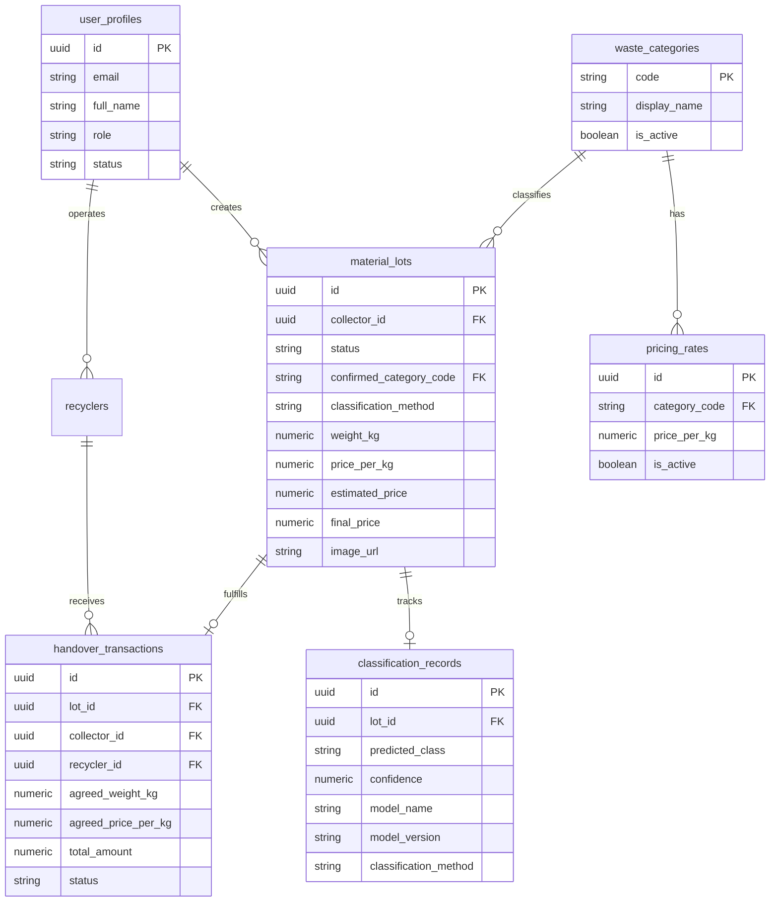

# Kabadiwala Connect — Backend Architecture & Technical Specification

> **SIH 2026 — Problem Statement 26229**  
> **System**: E-Waste Collection, AI Identification, Pricing, and Recycler Handover Platform  
> **Component**: Main Application Backend (Spring Boot Modular Monolith)

---

## 1. Executive Summary & System Architecture

Kabadiwala Connect is a digital platform designed for informal waste collectors ("kabadiwalas") in India to streamline e-waste aggregation, identification, dynamic pricing, and handover to verified recyclers.

The backend is built as a **modular monolith** in **Spring Boot 3.x (Java 21)**. Machine Learning inference is decoupled into a dedicated Python/FastAPI micro-service communicating over an HTTP inference contract.

```text
                        React Web / Android Mobile Client
                                      │
                                      │ HTTPS + Bearer JWT
                                      ▼
                        ┌───────────────────────────────┐
                        │    Spring Boot Main Backend   │
                        │       (Modular Monolith)      │
                        └───────────────┬───────────────┘
                                        │
             ┌──────────────────────────┼──────────────────────────┐
             │                          │                          │
             ▼                          ▼                          ▼
     Supabase Auth                 PostgreSQL               Supabase Storage
   (JWT Verification)          (Flyway Migrations)         (Material Photos)
                                        │
                                        │ HTTP REST (Contract)
                                        ▼
                              FastAPI ML Service
                         (ViT / EfficientNet / ONNX)
```

---

## 2. Core Architectural Principles

1. **Simplicity Over Distributed Overhead**: An SIH prototype modular monolith without Kafka, Kubernetes, or microservices for standard business domains.
2. **ML Independence**: The backend depends only on an abstract contract (`WasteClassifierClient`). Swapping ML backends (ViT $\to$ EfficientNet $\to$ MobileNet $\to$ on-device TFLite) requires zero changes to the Spring Boot business logic or client contracts.
3. **Decoupled Taxonomies**: The 14 worker-facing e-waste categories are decoupled from raw ML training classes via `TaxonomyMappingService`.
4. **Low-End Android Optimization**: Compact DTOs, image URL references (no base64 blobs in JSON), paginated responses, and graceful fallback to manual entry when ML is unreachable.
5. **Auditable Provenance**: Explicit tracking of classification methods (`MANUAL`, `AI_CONFIRMED`, `AI_CORRECTED`), recording model name, model version, and confidence for every lot.

---

## 3. Module Responsibilities

```text
com.kabadiwala.backend
├── auth/           # Supabase JWT token conversion, UserPrincipal, SecurityUtils
├── common/         # Generic ApiResponse<T>, ApiErrorResponse, GlobalExceptionHandler, Exceptions
├── config/         # SecurityConfig, OpenApiConfig
├── material/       # WasteCategory, MaterialLot, LotStatus, MaterialLotService, Controller
├── classification/ # ClassificationRecord, TaxonomyMappingService, ClassificationService
├── pricing/        # PricingRate, PricingService, Price estimation, PricingController
├── recycler/       # Recycler facility entity, rule-based matching service, RecyclerController
├── transaction/    # HandoverTransaction, HandoverService, TransactionController
├── storage/        # StorageService interface, SupabaseStorageService, LocalStorageService fallback
└── ml/             # WasteClassifierClient interface, FastApiClient, MlPredictionResponse DTO
```

### Module Interactions & Data Flow

```text
Collector: Create Lot (Draft)
    ↓
Upload Photo & Trigger AI Classification
    ↓ (Spring Boot calls FastAPI)
FastAPI returns { predicted_class: "PCB", confidence: 0.94, model: "ewaste-v1" }
    ↓ (TaxonomyMappingService maps "PCB" -> "PCB / Circuit Board")
Worker Confirms or Corrects -> MaterialLot Status: CLASSIFIED
    ↓
Record Measured Weight (kg) -> PricingService calculates estimatedPrice = weight × pricePerKg
    ↓ (MaterialLot Status: PRICED)
Mark Ready -> MaterialLot Status: READY_FOR_HANDOVER
    ↓
Match Recyclers in City accepting Category
    ↓
Initiate Handover -> MaterialLot Status: HANDED_OVER, HandoverTransaction: INITIATED
    ↓
Recycler Weighs & Accepts -> MaterialLot Status: COMPLETED, HandoverTransaction: COMPLETED
```

---

## 4. Database Schema Design (Flyway Versioned)

### Entity-Relationship Diagram



---

## 5. Worker Taxonomy & Classification Design

### Worker-Facing Categories (Seed V2)

1. `PCB`: PCB / Circuit Board (₹180/kg)
2. `CABLE_WIRE`: Cable / Wire (₹160/kg)
3. `BATTERY`: Battery (₹45/kg)
4. `MOTOR_MECHANICAL`: Motor / Mechanical (₹55/kg)
5. `DISPLAY_SCREEN`: Display / Screen (₹35/kg)
6. `STORAGE_DEVICE`: Storage Device (₹120/kg)
7. `CHARGER_ADAPTER`: Charger / Adapter / Power Supply (₹50/kg)
8. `PHONE_SMALL_ELECTRONICS`: Phone / Small Electronics (₹150/kg)
9. `ELECTRONIC_COMPONENTS`: Electronic Components (₹90/kg)
10. `PLASTIC_EWASTE`: Plastic E-Waste (₹18/kg)
11. `METAL_SCRAP`: Metal E-Waste / Scrap (₹35/kg)
12. `OTHER_EWASTE`: Other E-Waste (₹25/kg)
13. `MIXED_EWASTE`: Mixed E-Waste (₹30/kg)
14. `NON_EWASTE`: Not E-Waste (₹0/kg)

### Classification Methods

- **`MANUAL`**: The collector identifies the category without consulting the AI model.
- **`AI_CONFIRMED`**: The collector accepts the AI suggestion.
- **`AI_CORRECTED`**: The collector overrides the AI suggestion with a different category.

> [!NOTE]
> **Prototype ML Mapping Limitation**: Whole complex devices such as `Laptop` and `Router` from the ML model are currently mapped to `OTHER_EWASTE` in `TaxonomyMappingService`. This is a deliberate prototype design to avoid premature taxonomy fragmentation; it will be revisited after model training and evaluation experiments.


---

## 6. Authentication & Authorization Flow

- **Authentication Provider**: Supabase Auth issues JWT Bearer tokens upon user sign-in.
- **Validation**: Spring Security validates JWTs statelessly via JWKS / issuer verification.
- **Principal Mapping**: `SupabaseJwtAuthenticationConverter` maps the `sub` claim to `UserPrincipal` and extracts the role.
- **Authorization Roles**:
  - `ROLE_COLLECTOR`: Can create, view, weigh, and handover their own material lots.
  - `ROLE_RECYCLER`: Can accept or reject assigned lot handovers.
  - `ROLE_ADMIN`: Full access to configure rates, users, and audit logs.
- **Ownership Verification**: `SecurityUtils.verifyOwnershipOrAdmin(ownerId)` ensures collectors cannot view or mutate other collectors' lots.

---

## 7. ML Integration Contract (Spring Boot $\leftrightarrow$ FastAPI)

- **Interface**: `WasteClassifierClient`
- **Implementation**: `FastApiClient`
- **Protocol**: HTTP `POST {ML_SERVICE_URL}/api/v1/predict` (Multipart file: `image`)
- **JSON Response Contract**:
  ```json
  {
    "predicted_class": "PCB",
    "confidence": 0.942,
    "model_name": "ewaste-classifier",
    "model_version": "v1.0.0",
    "inference_latency_ms": 115,
    "needs_confirmation": true
  }
  ```
- **Resilience**: If the ML service times out or is offline, the backend throws `MlServiceException` (HTTP 503) and advises the mobile client to proceed with `MANUAL` classification without halting the worker.

---

## 8. Storage Architecture

- **Interface**: `StorageService`
- **Implementations**:
  - `SupabaseStorageService`: Uploads images to Supabase Storage bucket (`ewaste-images`) and returns public CDN URLs.
  - `LocalStorageService`: Stores images on the local filesystem (`./storage/uploads`) for zero-dependency local development and automated testing.
- **Data Integrity**: Database stores only the storage path / reference and URL; no binary blobs are stored in PostgreSQL.

---

## 9. Major REST API Endpoints

| Method | Path | Description | Access |
|---|---|---|---|
| `GET` | `/api/v1/categories` | List active 14 worker-facing categories | Public |
| `GET` | `/api/v1/pricing/rates` | List active price-per-kg rates | Authenticated |
| `GET` | `/api/v1/pricing/estimate` | Compute estimate for category & weight | Authenticated |
| `POST` | `/api/v1/material-lots` | Draft a new material lot | COLLECTOR |
| `GET` | `/api/v1/material-lots` | List collector's own lots (paginated) | COLLECTOR |
| `GET` | `/api/v1/material-lots/{id}` | Get detailed lot record with pricing | COLLECTOR, ADMIN |
| `POST` | `/api/v1/material-lots/{id}/classify-ai` | Send photo to ML service for prediction | COLLECTOR |
| `POST` | `/api/v1/material-lots/{id}/confirm-classification` | Confirm or correct waste category | COLLECTOR |
| `POST` | `/api/v1/material-lots/{id}/record-weight` | Record weight (kg) & compute price | COLLECTOR |
| `POST` | `/api/v1/material-lots/{id}/ready-for-handover` | Transition lot to READY_FOR_HANDOVER | COLLECTOR |
| `GET` | `/api/v1/recyclers/matching` | Find active recyclers by category & city | Authenticated |
| `POST` | `/api/v1/transactions` | Initiate lot handover to recycler | COLLECTOR |
| `POST` | `/api/v1/transactions/{id}/accept` | Accept handover and complete settlement | RECYCLER |
| `POST` | `/api/v1/transactions/{id}/reject` | Reject handover, reverting lot to READY | RECYCLER |

---

## 10. Future Extension Points

1. **On-Device TFLite / ONNX Runtime**: For remote rural areas with zero network connectivity, the mobile client can run local on-device inference and pass the prediction directly with `classificationMethod = AI_CONFIRMED`.
2. **Dynamic / Tiered Pricing Engine**: Future extensions can incorporate grade-based discounts (e.g. damaged screens vs intact screens) without breaking the simple `weight × rate` calculation.
3. **Automated Payout Settlement**: Integration with UPI / Aadhaar Enabled Payment System (AePS) when transactions transition to `COMPLETED`.
